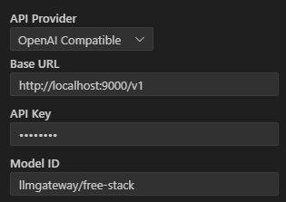

# Fault-Tolerant LLM Gateway
---
<div align="center" style="text-align: center;">
 &nbsp;
 <a href="https://www.paypal.com/donate/?business=G47L9N4UW8C2C&no_recurring=1&item_name=Thank+you+%21%21%21&currency_code=USD"></a>
</div>
<br>

Don't experience failures from API calls to your LLM models anymore, no matter which provider you're using.  
This project can replace providers to give you a nearly infallible LLM model provider.  
LLM Gateway works as an OpenAI-compatible LLM API provider with advanced fallback support for models in case of response failures.  
Use it with code agents like Cline, RooCode, or even with your apps as a regular LLM provider compatible with the OpenAI API.  
## Features

## Gateway endpoints

  - `/v1/models` - Like v1, just lists available models <br/><br/>
  - `/v1/chat/completions` - OpenAI compatible API that routes calls to other providers with fallback in case of call failure.
  **HOT FEATURE:** This endpoint allows you to create a sequence of fallback models to be called in case of failure, i.e., if a model response fails, it automatically calls the next in the fallback sequence and so on. The model's sequence can consist of different models and different providers. For example, the first model in the sequence is deepseek-chat from OpenRouter; we can configure the gateway to fall back to gpt-4o in OpenAI in case of failure. This fallback sequence can be of any size and must be configured in the file **models_fallback_rules.json**.

## Configuration

Create a `.env` file from the example .env.example:
```bash
cp .env.example .env
```
 **.env** configuration example:
 ```bash
# This gateway must have its own API key that clients must use to access it
# Use it in http header as "Authorization: Bearer <ThisGatewayApiKey>"
GATEWAY_API_KEY=<ThisGatewayApiKey>

# Maximum number of log files to keep (older files will be deleted)
LOG_FILE_LIMIT=15

# Enable/disable logging of chat messages to the /logs folder (true/false). 
# Useful for debugging
LOG_CHAT_ENABLED=false

# The default fallback provider to use when the model received is not recognized 
# by this gateway in the fallback rules.
FALLBACK_PROVIDER=openrouter

# The keys of your providers. Used in the providers
# Fill the ones you want to use or add more if you like
APIKEY_OPENROUTER=<your_openrouter_api_key>
APIKEY_REQUESTY=<your_requesty_api_key>
APIKEY_OPENAI=<your_openai_api_key>
APIKEY_NEBIUS=<your_nebius_api_key>
APIKEY_TOGETHER=<your_together_api_key>
APIKEY_KLUSTERAI=<your_klusterai_api_key>
```

### Environment Variables

| Variable | Description | Default |
|----------|-------------|---------|
| `GATEWAY_API_KEY` | Fixed API key clients must use to access this gateway | *required* |
| `LOG_FILE_LIMIT` | Maximum number of chat log files to keep | `15` |
| `LOG_CHAT_ENABLED` | Enable detailed chat logging to `logs/` directory | `true` |
| `FALLBACK_PROVIDER` | Default provider name for `/v2` if no rule matches | `openrouter` |
| `APIKEY_PROVIDERNAME` | API key for a specific provider (e.g., `APIKEY_OPENROUTER`) | *required for providers in providers.json* |

### Provider Mapping (`provider_mapping.json`)

This JSON file defines the available backend LLM providers and the routing rules for the `/v2/chat/completions` endpoint. It allows for complex routing strategies, including failover and provider-specific configurations.

**Structure:**

-   **`providers`**: An array of objects, where each object defines a backend provider.
    -   Key: The internal name used to refer to this provider (e.g., "openrouter", "requesty").
    -   Value: An object containing:
        -   `baseUrl`: The base URL for the provider's API.
        -   `apikey`: The **name** of the environment variable holding the API key for this provider (e.g., "APIKEY_OPENROUTER"). The actual key is read from the environment.
        -   `multiple_models` (optional, boolean): Set to `true` for providers (like Requesty) that allow specifying a list of models to try in sequence within a single rule.
-   **`models`**: An array of objects, defining routing rules for specific model names requested by the client.
    -   `model`: The model name the client will request (e.g., "llmgateway/free-stack", "deepseek/deepseek-chat-v3-0324").
    -   `providers`: An array defining the sequence of providers to try for this model. Each element in this array is an object:
        -   Key: The internal name of the provider (must match a key in the main `providers` list).
        -   Value: An object containing provider-specific instructions:
            -   `modelname` (optional): The actual model name to request from this specific backend provider. If omitted, the client's requested `model` name is used.
            -   `providers_order` (optional, for providers like OpenRouter): A list of sub-provider names to try *within* this backend provider, in the specified order. The gateway will make separate requests for each sub-provider.
            -   `models` (optional, used when `multiple_models` is true for the provider): A list of actual model names to try sequentially *on this specific provider*. The gateway will make separate requests for each model in this list.

**Example (`models_fallback_rules.json`):**

```json
[
    {
        // an example of only free models which we'll call "llmgateway/free-stack"
        "gateway_model_name": "llmgateway/free-stack",
        "fallback_models" :
        [
            {
                "provider": "openrouter",
                "model" : "google/gemini-2.5-pro-exp-03-25",
                "providers_order" : ["Google AI Studio"]
            },
            {
                "provider": "requesty",
                "model" : "google/gemini-2.5-pro-exp-03-25"
            },
            {
                "provider": "openrouter",
                "model" : "deepseek/deepseek-chat-v3-0324:free",
                "providers_order" : ["Chutes", "Targon"]
            }
        ]                    
    },
    {
        // an example of a model that exists in various providers
        "gateway_model_name": "llmgateway/deepseek-v3.1", 
        "fallback_models" :
        [
            {
                "provider": "openrouter",
                "model" : "deepseek/deepseek-chat-v3-0324",
                "providers_order" : ["Lambda", "DeepInfra", "Nebius AI Studio"]
            },
            {
                "provider": "nebius",
                "model": "deepseek-ai/DeepSeek-V3-0324"
            },
            {
                "provider": "together",
                "model" : "deepseek-ai/DeepSeek-V3"
            },
            {
                "provider": "requesty",
                "model" : "novita/deepseek/deepseek-v3-0324"
            },
            {
                "provider": "requesty",
                "model" : "novita/deepseek/deepseek-v3-turbo"
            }
        ]                    
    }
]    
```

**Failover Logic:**

When a request comes to `/v1/chat/completions`:

1.  The gateway finds the rule matching the requested `model` in the models_fallback_rules.json
2.  If the model is not found in the rules, route the request to the fallback provider defined by the FALLBACK_PROVIDER environment variable. The name of the model is the same as received.
3.  If it finds the model, call the model defined in the first rule to its corresponding provider.
4.  If the first call fails, try the next ones until some succeed
5.  Return error HTTP 503 if none of the called models succeed.

## Running

## With pip

Install Python dependencies once if you're using pip:
```bash
pip install -r requirements.txt
```
and run
```bash
python llmgateway.py
```


### With UV (preferable)
if uv is installed, simply do:
```bash
uv run llmgateway.py
```


## Using with Cline Example
You can use it with Cline, RooCode, or any other code agent.
You just need to configure it as an OpenAI-compatible provider.
Here is an example of using this gateway with Cline, set to use the model `'llmgateway/free-stack'`, which only uses models free of charge, as configured in the example above.

