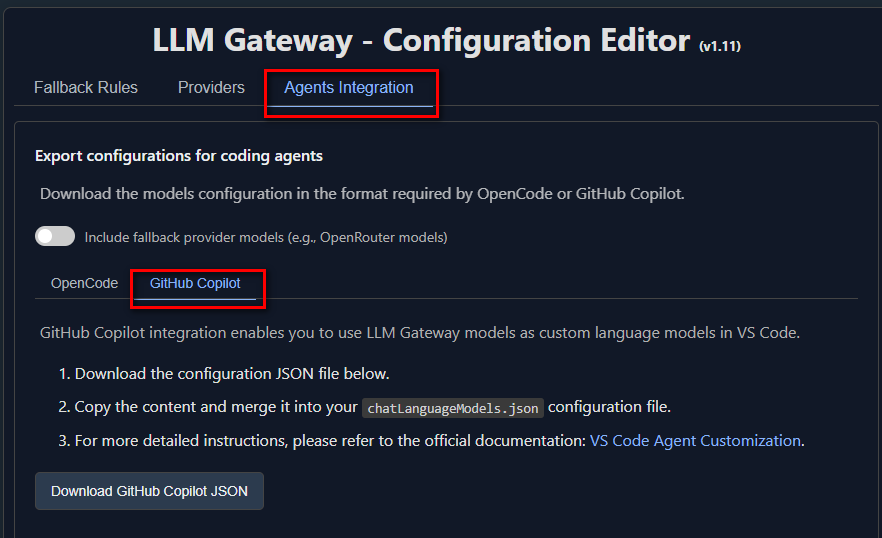
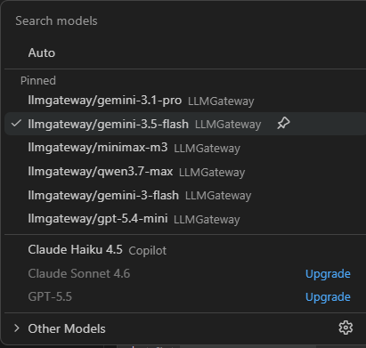
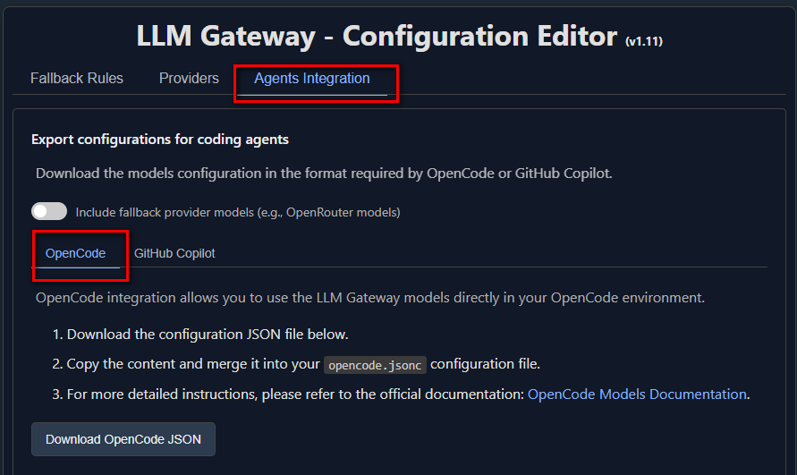
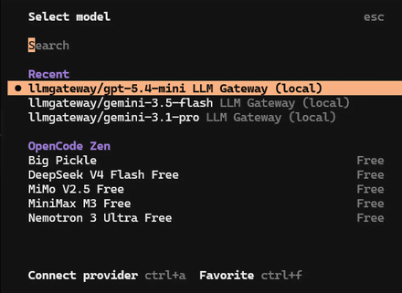
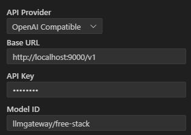
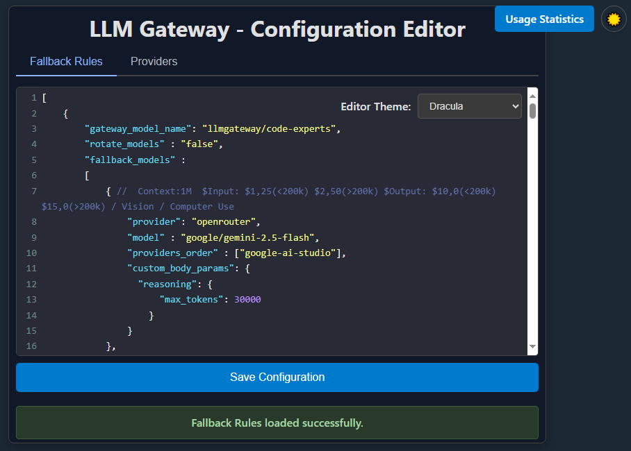
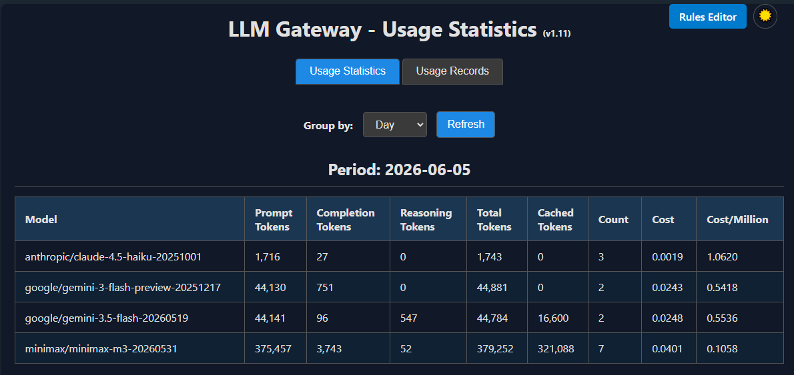
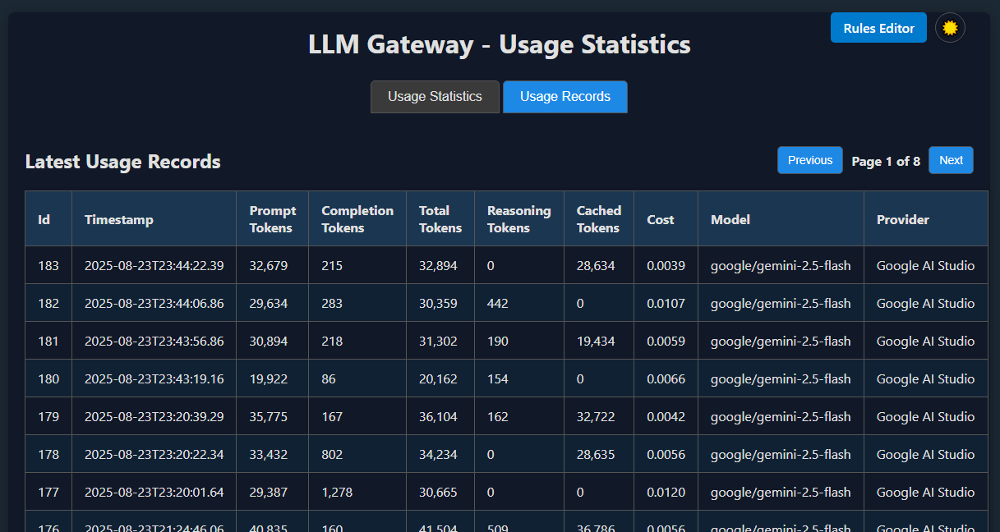

# Fault-Tolerant Personal LLM Gateway
---
<div align="center" style="text-align: center;">
 &nbsp;
 <a href="https://openrouter.ai"></a>
 &nbsp;
 <a href="https://www.paypal.com/donate/?business=G47L9N4UW8C2C&no_recurring=1&item_name=Thank+you+%21%21%21&currency_code=USD"></a>
 <br>
 <a href="https://cline.bot/"></a>
 <a href="https://roocode.com/"></a>
  
</div>
<br>
 
This project is a personal LLM Gateway that allows developers to use LLMs from different LLM providers with features like fault tolerance, model load balancing, customized model requests, call retries, and more.
The LLM Gateway works locally as an OpenAI-compatible LLM API provider with advanced fallback support for models in case of response failures.
Use it with code agents like Cline, RooCode, or even with your applications as a regular OpenAI API-compatible LLM provider.

## Changelog

See: [Changelog](CHANGELOG.md)


## Features

- **Fault Tolerance**: Automatically falls back to alternative models if the primary model fails.
- **OpenRouter Provider Ordering**: Define the order of the providers routed by OpenRouter.
- **Model Rotation**: Optionally rotates through available models for each API key, distributing load and cost across providers.
- **Flexible Configuration**: Configure fallback sequences and rotation settings per model.
- **Custom LLM Parameters**: Configure custom request parameters for any LLM model.
- **Usage Statistics**: Track the cost and consumption of tokens per hour, day, week, or month.
- **NEW** - Coding Agents integrations for OpenCode and GitHub Copilot. See the ["Coding Agents Integration"](coding-agents-integration) for more information.

## Getting Started

Before running the gateway, you need to create the configuration files from the provided examples and edit them accordingly.

1.  **Environment Variables**:
    ```bash
    cp .env.example .env
    ```
2.  **Providers Configuration**:
    ```bash
    cp providers.json.example providers.json
    ```
3.  **Fallback Rules**:
    ```bash
    cp models_fallback_rules.json.example models_fallback_rules.json
    ```

See [Gateway Configuration](#gateway-configuration) for more information about how to configure these files.


## Gateway endpoints

- `/v1/models` - lists the available gateway models as configured in the rules editor.
- `/v1/chat/completions` - All the magic happens here. This is an OpenAI-compatible chat completions API that can be used with any OpenAI-compatible client (like Cline, OpenCode, etc.) or application. It routes calls to your configured gateway models with fallback support and custom parameter injection.

  > The **LLMApiGateway** chat completions API supports:
  - `retries`: on timeout or rate-limit errors, apply after a timeout period (useful for freeing models that apply token limits)
  - `OpenRouter providers ordering` - define the allowed providers for OpenRouter. Useful to choose and define the order of OpenRouter model's providers accepted.
  - `model rotation` - call models in sequence in a rotational manner (if configured)
  - `custom parameter injection` - inject parameters like `reasoning_effort`, `temperature`, `top_p`, and even the new `service_tier` for OpenRouter, Gemini, and OpenAI models, which allows you to greatly reduce model costs.

## Coding Agents Integration 

### GitHub Copilot Integration

Open the **Agents Integration** tab and select the **"GitHub Copilot"** sub-tab, then download the JSON file with the model configuration for GitHub Copilot. Copy the contents of the file and merge them into your **chatLanguageModels.json** configuration file.



Once integrated, the LLMApiGateway models can be seen in the copilot model list




### OpenCode Integration

Open the **Agents Integration** tab and select the **OpenCode** sub-tab. Then download the JSON file with the model configuration for OpenCode. Copy the file’s contents and merge them into your `opencode.json` configuration file.



Once integrated, the LLMApiGateway models can be seen in the OpenCode model list.



### Cline (VS Code Extension)

For Cline you just need to configure it as an OpenAI-compatible provider. Here is an example of using this gateway with Cline, set to use the model `'llmgateway/free-stack'`, which only uses models free of charge, as configured in the example above.




## Gateway Configuration

### The `.env` file

The `.env` file must be configured as shown in the example below:

### **.env** configuration example:
 ```
# this gateway HTTP PORT
GATEWAY_PORT=9100

# This gateway must have its own API key that clients must use to access it
# Use it in http header as "Authorization: Bearer <ThisGatewayApiKey>)""
GATEWAY_API_KEY=<ThisGatewayApiKey>

# Maximum number of log files to keep (older files will be deleted)
LOG_FILE_LIMIT=15

# Enable/disable logging of chat messages to the /logs folder (true/false). Useful to debug
LOG_CHAT_ENABLED=true

# The default fallback provider to use when the model received is not recognized 
# by this gateway in the fallback rules.
FALLBACK_PROVIDER=openrouter

# The keys of your providers. It can be here (recomended) or in the providers.json file
# Fill the ones you want to use or add more if you like
APIKEY_OPENROUTER=<your_openrouter_api_key>
APIKEY_REQUESTY=<your_requesty_api_key>
APIKEY_OPENAI=<your_openai_api_key>
APIKEY_NEBIUS=<your_nebius_api_key>
APIKEY_TOGETHER=<your_together_api_key>
APIKEY_KLUSTERAI=<your_klusterai_api_key>
APIKEY_GOOGLE=<your_google_api_key>

```

### Environment Variables

| Variable | Description | Default |
|----------|-------------|---------|
| `GATEWAY_API_KEY` | Fixed API key clients must use to access this gateway | *required* |
| `LOG_FILE_LIMIT` | Maximum number of chat log files to keep | `15` |
| `LOG_CHAT_ENABLED` | Enable detailed chat logging to `logs/` directory | `true` |
| `FALLBACK_PROVIDER` | Default provider name for `/v2` if no rule matches | `openrouter` |
| `APIKEY_PROVIDERNAME` | API key for a specific provider (e.g., `APIKEY_OPENROUTER`) | *required for providers in providers.json* |


### Edit providers and fallback rules
Before starting to use LLMGateway, you need to fill in your providers and models with their fallback rules by accessing the configuration page with your web browser at http://localhost:9100 and you will be redirected to the rules editor. Refer to the following sections to learn how to structure these rules.




## Providers Example (`providers.json`)
Here, you must define your providers. These providers must be compatible with the OpenAI API format.
The `apikey` fields are keys to the environment variables with the actual key value.

```json
[
    {
        "openrouter":
        {
            "baseUrl" : "https://openrouter.ai/api/v1",            
            "apikey" : "APIKEY_OPENROUTER"  //environment variable name that holds the provider apykey
        }
    },
    {
        "nebius":
        {
            "baseUrl" : "https://api.studio.nebius.ai/v1",            
            "apikey" : "APIKEY_NEBIUS" //environment variable name that holds the provider apykey
        }
    },
    {
        "openai":
        {
            "baseUrl" : "https://api.openai.com/v1",            
            "apikey" : "APIKEY_OPENAI" //environment variable name that holds the provider apykey
        }
    }
]
```


### Fallback Rules JSON Example (`models_fallback_rules.json`):

>[!Note]
> You can edit the fallback rules using web browser in `http://localhost:9100/v1/ui/ rules-editor`

#### Simple fallback 
In this mode (`rotate_models=false`), the gateway always starts with the first model in each request and falls back to the next ones in case of failures.<br>
Retries can be also configured for each model.
```json
[
    {
        "gateway_model_name": "llmgateway/free-stack", // this gateway model to be referenced
        "rotate_models" : "false", // no rotation, always starts with the first model and falls back to the next in case of failure
        "fallback_models" :
        [
            { 
                "provider": "openrouter",
                "model" : "deepseek/deepseek-r1:free",
                "retry_delay" : 15,     // retry delay in seconds for this model in case of failure
                "retry_count" : 3,      // how many times to retry
                "providers_order" : ["Chutes", "Targon"] // Force provider order in openrouter for this model
            },
            {
                "provider": "requesty",
                "model" : "google/gemini-2.5-pro-exp-03-25"
            },
            {
                "provider": "openrouter",
                "model" : "deepseek/deepseek-chat-v3-0324:free",
                "use_provider_order_as_fallback": true, // use providers_order as fallback
                "providers_order" : ["Chutes", "Targon"] // if use_provider_order_as_fallback is true, this will be used as fallback one by one
            }
        ]                    
    }
]
```

#### Model Rotation
In this mode (`rotate_models=true`), the gateway cycles through all models between requests. This is useful when we want to utilize credits from various providers. Fallback also works in this mode in case of failures; the sequence loops back to the first model when the sequence finishes.
```json
[
    {
        // an example of a model that exists in various providers
        "gateway_model_name": "llmgateway/deepseek-v3.1", 
        "rotate_models": true,  // When true, gatweway will rotate through models between requests. Retry is ignored in this mode
        "fallback_models" :
        [
            {
                "provider": "openrouter",
                "model" : "deepseek/deepseek-chat-v3-0324",
                "providers_order" : ["Lambda", "DeepInfra", "Nebius AI Studio"]
            },
            {
                "provider": "nebius",
                "model": "deepseek-ai/DeepSeek-V3-0324"
            },
            {
                "provider": "requesty",
                "model" : "novita/deepseek/deepseek-v3-0324"
            }
        ]                    
    }
]    
```

#### Custom Parameters and Headers Injection/Override
For any model, you can inject or override custom headers or body parameters by specifing it in the rules.
Here is an example of using grok-3-mini-beta from xAI that accepts an `reasoning_effort` parameter.
Custom headers a also available if needed.
```json
[
    {
        // an example of a model with custom body
        "gateway_model_name": "llmgateway/xAI", 
        "fallback_models" :
        [
            {
                "provider": "xAI",
                "model" : "grok-3-mini-beta",                
                "custom_body_params" : {
                    "reasoning": { "effort": "high" }  // grok has this reasoning/effort parameter that can be set like this
                },
                "custom_headers" : {
                    "x-param" : "demo"  // custom header example
                }
            }
        ]                    
    }       
]    
```


**Failover and Rotation Logic:**

When a request comes to `/v1/chat/completions`:

1.  The gateway finds the rule matching the requested `model` in the `models_fallback_rules.json` file.
2.  If the model is not found in the rules, the gateway routes the request to the fallback provider defined by the FALLBACK_PROVIDER environment variable. The name of the model will be the same as received.
3.  If model rotation is enabled (`"rotate_models": true`), the gateway selects the next model in the sequence for each request.
4.  If model rotation is disabled (`"rotate_models": false` or ommited), the gateway always starts with the first model in the sequence and only falls back to the next ones in case of failure.
5.  (OpenRouter only) If the current model has the parameter `use_provider_order_as_fallback=true` and has a list of `providers_order`, the gateway will use only the first provider in the list and fall back to the next ones only in case of failures. This way, the fallback is treated by this gateway and not OpenRouter.
6.  If the selected model fails, the gateway tries the next models in the sequence until one succeeds.
7.  Return an HTTP 503 error if none of the called models succeed.

**Model Rotation:**

The model rotation feature allows you to distribute requests across multiple providers even when there are no failures. This is useful for:

- Load balancing across different providers
- Avoiding rate limits on individual providers
- Reducing costs by distributing usage

The rotation state is tracked per API key and gateway model combination, ensuring consistent behavior for each client.

## Usage Statistics
From the page http://localhost:9100/v1/ui/usage-stats, you can see your usage statistics.

**Note**: The usage statistics page works best with token usage from OpenRouter API calls. Other providers will most probably be shown with empty values because token usage is not provided by their APIs or does not conform to OpenRouter's structure.






## Running

## With pip

Install Python dependencies once if you're using pip:
```bash
pip install -r requirements.txt
python main.py
```

### With UV (preferable)
if uv is installed, simply do:
```bash
uv venv
uv run main.py
```

### With Docker
if you prefer docker deployment see [this guide](/docker/README.md) (Thanks  [canadaduane](https://github.com/canadaduane)!👍)

