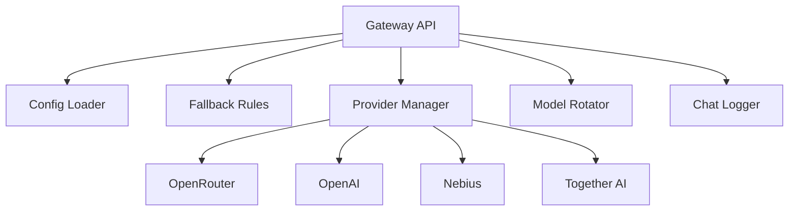

# LLM Gateway Project Brief

## Core Purpose
Provide fault-tolerant LLM API gateway with:
- OpenAI-compatible API interface
- Automatic model fallback on failure
- Model rotation for load/cost distribution

## Key Features
- `/v1/chat/completions` endpoint with fallback sequencing
- Configurable model rotation per API key
- Multi-provider support (OpenRouter, Nebius, Together AI, etc.)
- Detailed chat logging capabilities

## Architectural Components
