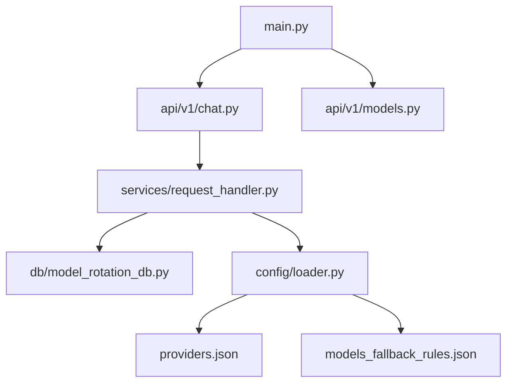

# Technical Context

## Core Stack
- Python 3.10+
- FastAPI (Web framework)
- Uvicorn (ASGI server)
- Pydantic (Configuration validation)
- httpx (HTTP client)
- SQLite (Rotation state storage)

## Project Structure


## Critical Modules
- `main.py`: FastAPI app setup and Uvicorn runner
- `llm_gateway_core/api/v1/`: API routers
- `llm_gateway_core/services/request_handler.py`: Core business logic
- `llm_gateway_core/config/loader.py`: Configuration loading
- `llm_gateway_core/db/model_rotation_db.py`: Rotation state management
- `providers.json`: Provider configurations
- `models_fallback_rules.json`: Fallback rules

## API Endpoint Structure
```python
# In llm_gateway_core/api/v1/chat.py
@router.post("/chat/completions")
async def chat_completion(request: Request):
    # Delegates to request_handler

# In llm_gateway_core/api/v1/models.py  
@router.get("/models")
async def list_models():
    # Delegates to request_handler
