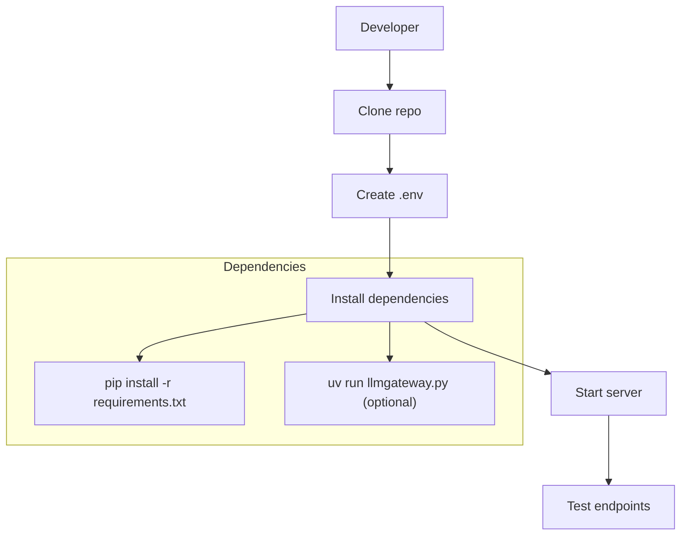

# Technical Context

## Core Stack
- Python 3.10+
- FastAPI (Web framework)
- Uvicorn (ASGI server)
- Pydantic (Configuration validation)
- aiohttp (Async HTTP client)
- SQLite (Rotation state storage)

## Development Setup


## Critical Dependencies
- `config_loader.py`: Central configuration management
- `llmgateway.py`: Main application entrypoint
- `providers.json`: Provider API endpoints and headers
- `db/model_rotation.py`: Rotation state management

## API Endpoint Structure
```python
@app.post("/v1/chat/completions")
async def chat_completion(request: Request):
    # Handler implementation

@app.get("/v1/models")
async def list_models():
    # Model listing logic
